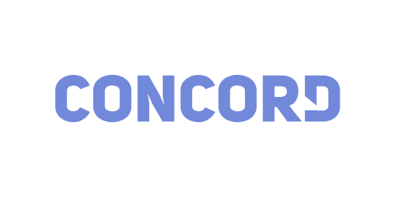

<h1 align="center">
  
</h1>

<h3 align="center">
  Chat realtime com nodejs e socket.io (e bots :robot::wave:)
</h3>

<p align="center">
  <a href="https://github.com/llbarbosas">
    
  </a>

  

  <a href="https://github.com/llbarbosas/concord/stargazers">
    
  </a>
</p>

<p align="center">
  <a href="#rocket-sobre-o-projeto">Sobre o projeto</a>&nbsp;&nbsp;&nbsp;|&nbsp;&nbsp;&nbsp;
  <a href="#runner-instalação">Instalação</a>&nbsp;&nbsp;&nbsp;|&nbsp;&nbsp;&nbsp;
  <a href="#memo-licença">Licença</a>
</p>

## :rocket: Sobre o projeto
Projeto pessoal para prática de conhecimentos sobre microsserviços, gRPC, websockets e para testar tecnologias interessantes, como o prisma 2.
A ideia foi simular a arquitetura de um chat realtime como o Discord.


### Possíveis features futuras
Veja os [docs](/docs/1.1.md)

## :runner: Instalação
```
// git clone ...

// Definir as variáveis do ambiente
cp .env.example .env

docker-compose -f docker-compose.yml up
```

## :memo: Licença

MIT Licence. See the file [LICENSE](LICENSE) for more details.
